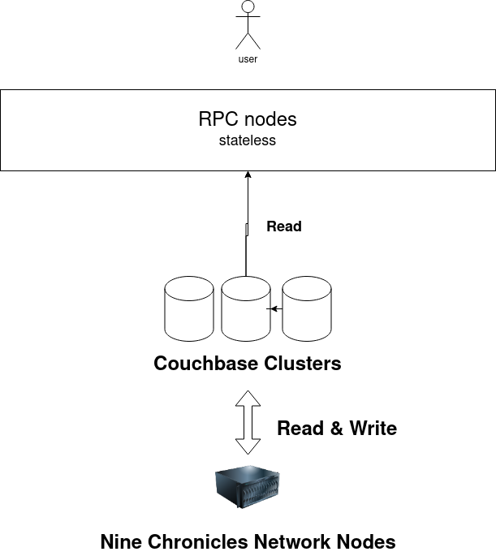

# libplanet-couchbase-store

A `Libplanet.Store.IStore` implementation with Couchbase

## Usecase

I'm building Nine Chronicles RPC mode service in @planetarium. The each RPC
nodes has its own RocksDB store in its local. But RPC mode's purpose is to serve
chain event and chain states to users so the nodes can be readonly. But current
model, it is not available because there is no sharable implementation. This
project targets an usecase like below image:

## Why Couchbase?

> Couchbase server is designed to provide easy-to-scale key-value or JSON
> document access with low latency and high sustained throughput.
>
> From [Couchbase Server -Wikipedia]

In my memory, the Couchbase is easy to scale out their clusters and Durango,
very awesome game I loved, also used it. And libplanet already had implemented
`RocksDBStore` with key-value database `RocksDB`. So I belive the
`RocksDBStore`'s codes can be re-used easily.

[Couchbase Server -Wikipedia]: https://en.wikipedia.org/wiki/Couchbase_Server
